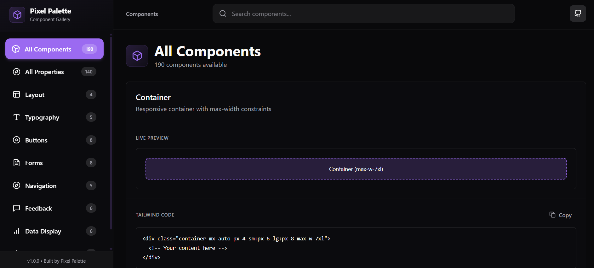

---
# 🎨 PixelPalette UI — Tailwind CSS Explorer

A **dark-themed Tailwind CSS component and utility exploration platform** built with **React, Vite, and pure JavaScript**.  
Designed to showcase UI engineering, motion polish, and developer-focused documentation through a single, cohesive interface.

---

## 📺 Preview

<p align="center">
  
</p>

---

## 🚀 Project Overview

PixelPalette UI is a frontend-only project focused on **clarity, interaction quality, and visual learning**.  
Instead of acting purely as a component gallery, the project now combines:

- A curated UI component showcase
- A comprehensive Tailwind CSS properties reference
- Intentional design constraints to maintain consistency and polish

The result is a focused, professional interface that feels closer to a real internal design system tool than a demo project.

---

## ✨ Key Features

### 🧩 UI Component Gallery
- Clean, production-style Tailwind components
- Consistent spacing, typography, and layout hierarchy
- Built for readability and reuse

### 📚 Tailwind Properties Explorer
- **140+ Tailwind CSS utilities** documented in one place
- Clear explanation of what each property does
- Syntax examples for quick reference
- Visual previews to reinforce understanding
- Designed to reduce constant context-switching to documentation

### 🎨 Single Dark Theme (Intentional)
- Custom dark purple theme across the entire app
- Theme toggles removed to maintain visual consistency
- Strong contrast and accessibility-aware color choices

### ⚡ Motion & UX Polish
- Smooth hover effects and transitions
- Subtle animations that enhance usability
- **Custom loading screen** featuring a 9-pixel boot animation before initial render

### 🔗 Minimal & Purposeful Navigation
- Simplified navigation for focus
- Direct **GitHub repository access** via navbar icon
- Removed unnecessary palette switching for a cleaner UX

---

## 🛠 Tech Stack

- **React**
- **Vite**
- **Tailwind CSS**
- **JavaScript (ES6+)**

> No backend, no TypeScript — the project intentionally highlights strong frontend fundamentals and UI architecture using plain JavaScript.

---

## 📁 Project Structure

```txt
src/
├── components/   # Reusable UI components
├── data/         # Component data & Tailwind property definitions
├── pages/        # Application views
├── hooks/        # Custom React hooks
└── lib/          # Shared utilities
```
## 📱 Responsive Design

Mobile-first layout using Tailwind breakpoints:

- xs 475px

- sm 640px

- md 768px

- lg 1024px

- xl 1280px

## ⚡ Quick Start
- npm install
- npm run dev


Local server:

http://localhost:5173
